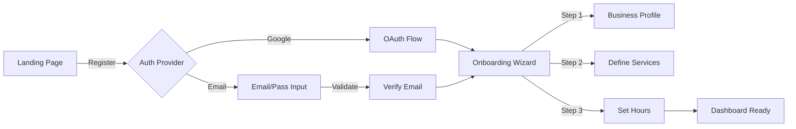
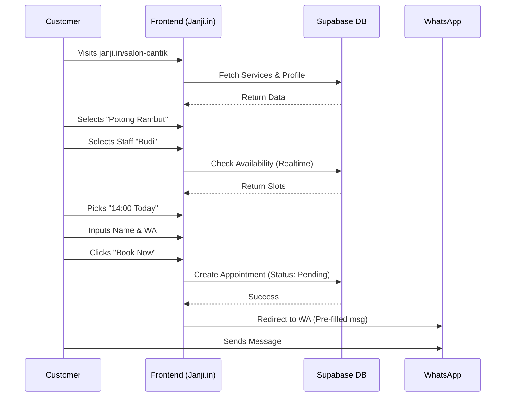
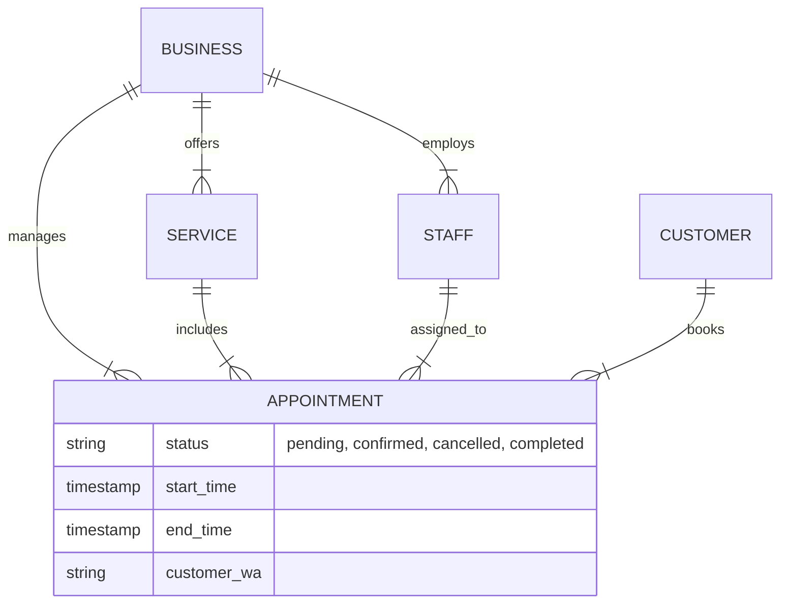

# Janji.in - Design Specifications (Phase 2)

## 1. Technology Stack (Final)
Optimized for **Solo Founder** (Speed, Low Cost, Scalability).

-   **Frontend:** Next.js 14 (App Router) + TypeScript.
-   **Styling:** Tailwind CSS + **Shadcn/UI** (Premium look, fast dev).
-   **Icons:** Lucide React.
-   **Backend / DB / Auth:** **Supabase**.
    -   *Auth:* Email/Password + Google OAuth.
    -   *Database:* PostgreSQL + Drizzle ORM.
    -   *Storage:* For localized profile images.
-   **Payments:** Xendit (Invoice/QRIS).
-   **Integration:** Google Calendar API (2-way sync).
-   **State Management:** React Query (TanStack Query) + Zustand.
-   **Deployment:** Vercel (Free tier mostly sufficient for MVP).

---

## 2. Non-Functional Requirements (NFR)

### Loading & Error States (Mandatory)
*   **Loading:** All data fetches must use Skeleton loaders (shadcn/ui `skeleton`). No spinning wheels only.
*   **Error:** Specific error boundaries. "Gagal memuat. [Coba Lagi]".
*   **Empty:** "Belum ada booking hari ini. Santai dulu bos." (Friendly copy).

### Performance
-   **Page Load:** Core Vitals LCP < 2.0s (Using Next.js SSG/ISR where possible).
-   **Booking Flow:** Optimized to complete in < 30s.

---

## 3. Information Architecture (IA)

### Marketing / Public
*   **Landing Page** (Value Prop, Templates Showcase)
*   **Pricing Page** (Free vs Pro)
*   **Login / Register** (OAuth, Email Magic Link)

### Business Dashboard (`app.janji.in`)
*   **Onboarding** (Template Selection: Salon/Barber/General)
*   **Overview** (Stats, Upcoming)
*   **Calendar** (Week/Day view, Google Cal Sync status)
*   **Bookings List** (Filter by Status)
*   **Management**
    *   **Services** (Pricing, Time)
    *   **Staff** (Assignments)
*   **Settings**
    *   **Profile** (Logo, Address)
    *   **Booking Page** (Slug, Deposit Rules)
    *   **Notifications** (WA Templates)

### Customer Facing (`[slug].janji.in`)
*   **Booking Link** (Service -> Staff -> Time -> Form -> Payment)
*   **Confirmation** (Success State, WhatsApp Redirection)


---

## 4. Flows & Diagrams

### Business Registration & Setup


### Customer Booking Journey


### Appointment Management System


---

## 5. Wireframes (ASCII) & Components

### Page 1: Landing Page (Public)
*Goal: Convert Visitor to Sign Up.*
```text
+------------------------------------------------------+
| Janji.in [Logo]                      [Masuk] [Daftar]|
+------------------------------------------------------+
|                                                      |
|   CAPE BALESIN CHAT "KAK CEK SLOT KOSONG"?           |
|                                                      |
|   Ubah "Tanya-tanya" jadi "Ting-Ting" (Duit Masuk)   |
|   Website booking instan untuk Jasa Kamu.            |
|                                                      |
|   [   COBA GRATIS SEKARANG ->   ]                    |
|   *Tanpa kartu kredit. Setup 5 menit.                |
|                                                      |
+------------------------------------------------------+
| Why Us?                                              |
| [Icon WA]     [Icon Duit]       [Icon Kalender]      |
| Notif WA      Anti No-Show      Anti Bentrok         |
+------------------------------------------------------+
|                                                      |
| Trusted by: Salon A, Barbershop B, Klinik C          |
|                                                      |
+------------------------------------------------------+
| Footer: Pricing | Login | Contact                    |
+------------------------------------------------------+
```
**Components:**
- `Navbar`: Sticky, clear CTA.
- `HeroSection`: Large typography, emotional hook (pain point), Primary Button (Shadcn Button lg).
- `FeatureGrid`: 3 cols, Lucide icons.
- `SocialProof`: Logos/Avatars component.

### Page 2: Business Onboarding
*Goal: Low friction setup.*
```text
+------------------------------------------------------+
| Janji.in                              Step 2 of 3    |
+------------------------------------------------------+
|                                                      |
|   Halo, Bos! Ceritain dikit tentang usahamu.         |
|                                                      |
|   Nama Usaha:                                        |
|   [ Barbershop Asgar 99                     ]        |
|                                                      |
|   Link Booking (Otomatis):                           |
|   janji.in/ [ asgar99                       ]        |
|                                                      |
|   Kategori:                                          |
|   (o) Salon  ( ) Klinik  ( ) Bengkel  ( ) Lainnya    |
|                                                      |
|   [       Lanjut: Atur Jasa & Harga >       ]        |
|                                                      |
+------------------------------------------------------+
```
**Components:**
- `ProgressBar`: Shadcn Progress.
- `InputForm`: React Hook Form + Zod validation.
- `SlugInput`: Auto-generated, editable, debounced availability check.
- `CategorySelect`: Radio Group or Cards.

### Page 3: Owner Dashboard (Calendar View)
*Goal: Bird's eye view.*
```text
+------------------------------------------------------+
| [Menu]  Dashboard                     [+ Booking]    |
+------------------------------------------------------+
| [Today]  <  Senin, 17 Des  >           [Day/Wk/Mon]  |
+------------------------------------------------------+
|       | Staff A      | Staff B      | Staff C        |
| 10:00 | [ PotongRmb ]|              |                |
| 10:30 | [ ..Budi    ]| [ Creambath ]| [---Blocked--] |
| 11:00 |              | [ ..Siti    ]|                |
| 11:30 |              |              | [ Smoothing  ] |
+------------------------------------------------------+
| Stats Hari Ini:                                      |
| 5 Booking  |  2 Menunggu  |  Estimasi: Rp 500rb    |
+------------------------------------------------------+
| [Home]   [Calendar]   [Jasa]   [Staff]   [Akun]      |
+------------------------------------------------------+
```
**Components:**
- `CalendarGrid`: CSS Grid based, drag-and-drop support (Phase 2), clickable slots.
- `AppointmentCard`: Colored by status, truncated text, click for details modal.
- `StatsTicker`: Simple summary row.
- `BottomNav` (Mobile): Fixed position, active state highlighting.

### Page 4: Booking Page (Public)
*Goal: Fast booking for customer.*
```text
+------------------------------------------------------+
|  <- Kembali       ASGAR 99                           |
+------------------------------------------------------+
|  [ Img ]  Asgar 99                                   |
|           "Ganteng Maksimal dalam 30 menit"          |
|           [Loc Icon] Jakarta Selatan                 |
+------------------------------------------------------+
|  PILIH SERVIS                                        |
|  +------------------------------------------------+  |
|  | [Gunting]  Gentlemen Cut              50rb >   |  |
|  |            45 min                             |  |
|  +------------------------------------------------+  |
|  | [Razor]    Shaving Premium            30rb >   |  |
|  +------------------------------------------------+  |
|                                                      |
+------------------------------------------------------+
```
*Clicking item opens Bottom Sheet:*
```text
+------------------------------------------------------+
|  Pilih Waktu & Staff                                 |
|                                                      |
|  Staff: [Any] [Budi] [Anto]                          |
|                                                      |
|  Tanggal: [ Hari Ini ] [ Besok ]                     |
|                                                      |
|  Jam Kosong (Budi):                                  |
|  [10:00]  [13:00]  [14:30]  [16:00]                  |
|                                                      |
|  [            Lanjut Isi Data (1/2)           ]      |
+------------------------------------------------------+
```
**Components:**
- `ServiceList`: Cards with image placeholder, title, price, duration.
- `BottomSheet`: Shadcn Drawer / Dialog for selection to keep context.
- `TimeSlotPicker`: Grid of buttons, disabled if booked.

### Page 5: Confirmation + WA Redirect
*Goal: Finalize and connect off-platform.*
```text
+------------------------------------------------------+
|  Konfirmasi Booking                                  |
+------------------------------------------------------+
|  Jasa:  Gentlemen Cut                                |
|  Staff: Budi                                         |
|  Waktu: Senin, 17 Des @ 14:00                        |
|                                                      |
|  Total: Rp 50.000                                    |
+------------------------------------------------------+
|  DATA KAMU                                           |
|  Nama:  [ Ahmad Dani       ]                         |
|  WA:    [ 0812xxxxxxxx     ]                         |
|                                                      |
|  Info: Bayar di tempat / Transfer DP via WA nanti.   |
+------------------------------------------------------+
|  [        BOOKING SEKARANG (Kirim WA)      ]         |
|  *Otomatis membuka WhatsApp ke Owner                 |
+------------------------------------------------------+
```
**Components:**
- `SummaryCard`: Clear typography for details.
- `PrimaryButton`: "Book Now" with WhatsApp icon.

### Page 6: Employee/Admin View (Mobile)
*Goal: Simple list for operational staff.*
```text
+------------------------------------------------------+
|  Halo, Budi! (Staff)                    [Logout]     |
+------------------------------------------------------+
|  Jadwal Kamu Hari Ini:                               |
|                                                      |
|  [ 10:00 ]  Pak Eko                                  |
|             Potong Rambut (45m)                      |
|             [ Lunas ] [ Masuk ]                      |
|                                                      |
|  [ 13:00 ]  Mas Tono                                 |
|             Shaving                                  |
|             [ Belum Bayar ]                          |
|                                                      |
|  --------------------------------------------------  |
|  Slot Kosong berikutnya: 14:00                       |
+------------------------------------------------------+
```
**Components:**
- `TimelineList`: Vertical list of appointments.
- `ActionButtons`: Quick status toggles (Check-in, Paid).
- `EmptyState`: "No upcoming bookings, chill dulu bos!"

